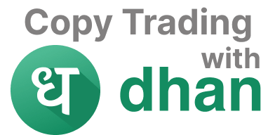
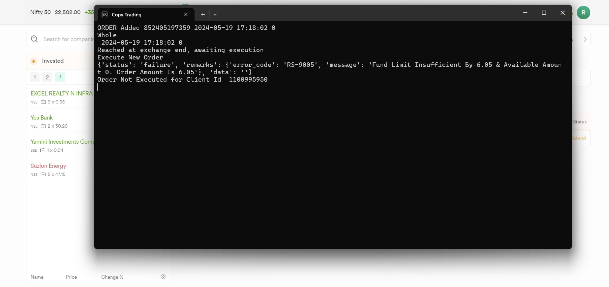
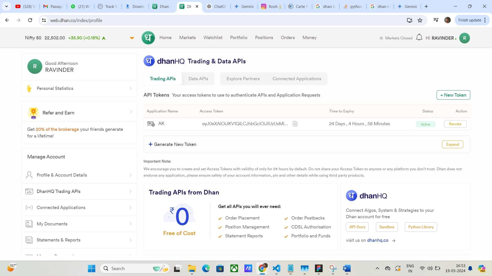

# Copy Trading Software



Welcome to the Copy Trading Software repository! This software allows users to copy trades from expert traders automatically. It is built with Python and offers a simple interface for setting up and managing your copy trading activities.

## Features

- **Automated Trading:** Automatically copy trades from expert master trader.
- **Real-Time Trade Execution:** Get real-time execution without facing any delay or legacy.
- **Console based Interface:** automatic working system, runs on PC startup.
- **Support Dhan Broker:** It supports Dhan broker for master and child accounts.

## Table of Contents

- [Installation](#installation)
- [Usage](#usage)
- [Configuration](#configuration)
- [Contributing](#contributing)
- [License](#license)

## Installation

To get started with the Copy Trading Software, follow these steps:

1. **Clone the repository:**

    ```bash
    git clone https://github.com/akshaykotish/CopyTradingDHAN
    cd copy-trading-software
    ```

2. **Create a virtual environment:**

    ```bash
    python -m venv venv
    source venv/bin/activate  # On Windows use `venv\Scripts\activate`
    ```

3. **Install the required dependencies:**

    ```bash
    pip install -r requirements.txt
    ```

4. **Set up your configuration:**

    Create a `.env` file in the project root and add your API keys and other configuration settings. Refer to the [Configuration](#configuration) section for more details.

## Usage

1. **Run the main script:**

    ```bash
    python main.py
    ```

    This will start the copy trading software and begin copying trades from the configured expert traders.

2. **Monitor your trades:**

    You can monitor the copied trades and view real-time updates in the console or via the provided web interface (if enabled).

### Screenshots


*Dashboard showing trade activities*


*Settings page to configure your preferences*

## Configuration

To configure the Copy Trading Software, you need to modify Childs.csv file with master account API details and child accounts details with following content:

```ini
o	In the Childs.csv file, replace the following placeholders with your information:
	Multiply: Enter the desired quantity multiplier for client orders (e.g., enter 2 to place double the quantity in child accounts).
	Client Id: Replace the placeholder with your copied Dhan Client ID.
	Client API: Replace the placeholder with your copied Dhan API key.
 
o	Adding Child Accounts: The first row in Childs.csv represents your master trading account. You can add additional rows for unlimited child accounts where trades will be copied. Ensure each row has the Client ID, API, and desired quantity multiplier.
```

- `API_KEY` and `Client ID`: Your trading platform's API key and Client ID.
- `Multiply Quantity`: Enter the desired quantity multiplier for client orders (e.g., enter 2 to place double the quantity in child accounts).

## Contributing

We welcome contributions from the community! To contribute to the project, please follow these steps:

1. **Fork the repository:**

    Click the "Fork" button at the top right of this page.

2. **Clone your fork:**

    ```bash
    git clone https://github.com/akshaykotish/CopyTradingDHAN
    ```

3. **Create a new branch:**

    ```bash
    git checkout -b feature/your-feature-name
    ```

4. **Make your changes and commit them:**

    ```bash
    git commit -m "Add your feature description"
    ```

5. **Push to your fork and create a pull request:**

    ```bash
    git push origin feature/your-feature-name
    ```

6. **Submit your pull request:**

    Go to the original repository on GitHub and submit a pull request with a description of your changes.

## License

This project is licensed under the MIT License. See the [LICENSE](LICENSE) file for details.

---

For any questions or support, feel free to open an issue or contact us at support@example.com.

Happy trading!
